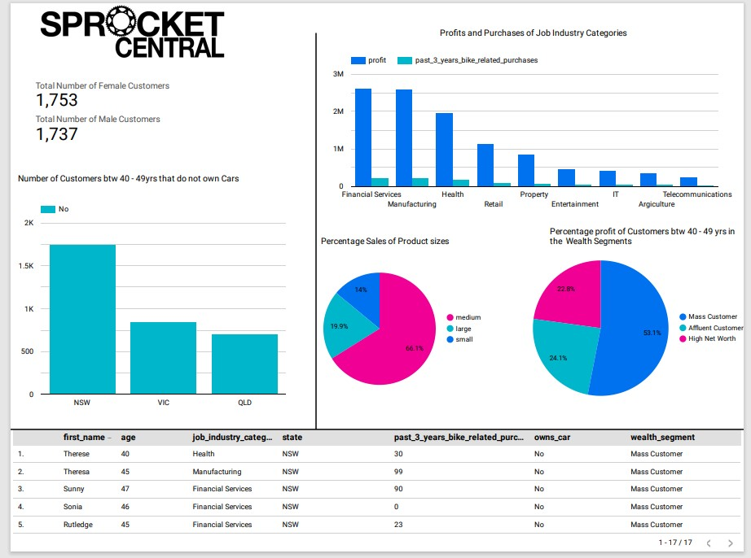
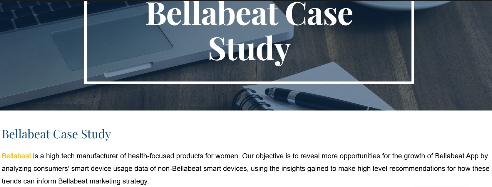
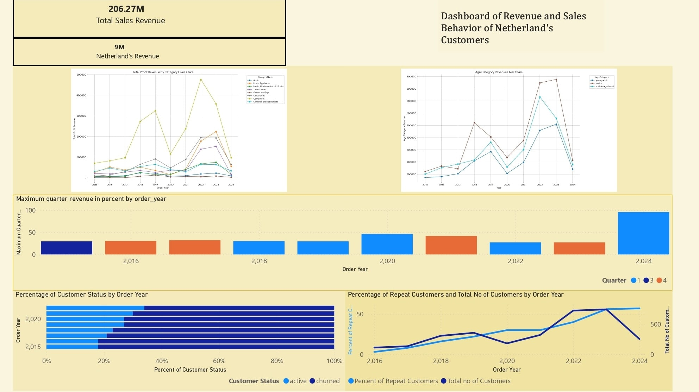

<!--Section 1: Introduce your self-->
## ABOUT ME

Hello! I'm Edosa Erhunmwunse 🤓, a detail-oriented data analyst who doubles as a technical operator in the oil and gas sector with 2 years of experience applying analytical and statistical tools and techniques in data collection, maintenance, and data analysis used in exposing trends and resolving anomalies impacting overall oil and gas production. I am skilled in collecting, transforming, and organizing data to give reasonable insights through proficient use of platforms like Excel spreadsheets, SQL, R, and Tableau. 
Certified Data Analyst with practical and theoretical understanding of the entire data analysis process who is ready for opportunities to collaborate and contribute to projects not limited to the oil and gas sector.

<!--Mention your top/relevant skills here - core and soft skills-->
## CORE SKILLS AND ABILITIES
•Organize, sort, filter and aggregate data for analysis using SPSS, R and SQL, can also perform basic calculations with functions and formulas. 
•Use of dashboards in Tableau, Power BI and Excel to present engaging data-driven stories. 
•Creating detailed data visualizations in RStudio. 
•Development of simple databases using MySQL. 

#### - ✅ CERTIFICATIONS.**
•	Alison Diploma in Data Analytics with Python          [May,2025].  
•	KPMG AU Data Analytics Virtual Experience Program Certification    [July, 2022]  
•	Google Data Analytics Professional Certificate               [May, 2022]  

<!--Section 2: List 3-4 key projects-->
## MY PORTFOLIO 

List of some projects worked on.

**Sprocket Central Case Study.**

Developed a model to identify the 1000 high valued customers needed by the marketing team.

[Read More](https://sites.google.com/view/edosasportfolio/sprocket-central-data)

**Bellabeat Case Study**

Revealed more opportunities for growth of Bellabeat App by analyzing data from consumers’ smart device usage of non-Bellabeat smart devices.

[Read More](https://www.kaggle.com/code/edosaerhunmwunse/bellabeat-case-study-r)

**Revenue and Dutch Customer Behavior Analysis of a Retail Store.**

We observed the maximum percent revenue in quarters Q1 and Q4 where computer category sold the most, expecially on saturdays. 

[Read More](https://github.com/Eddclectic/revenue_dutch)

## CONTACT DETAILS

*Please contact me through any of the medium below!*
<table>
  <tbody>
    <tr>
      <td>📧</td>
      <td><a href="mailto:Edosa.erhun@gmail.com">Edosa.erhun@gmail.com</a></td>
    </tr>
    <tr>
      <td>📞</td>
      <td>  </td>
    </tr>
    <tr>
      <td>📍</td>
      <td>Eindhoven, Netherlands</td>
    </tr>
    <tr>
      <td>⬇️</td>
      <td><a href="https://etuk123456.github.io/portfolio1/docs/Profile.pdf">Download my CV</a></td>
    </tr>
   
    
  </tbody>
</table>
